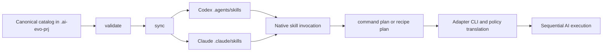

# AI Evo Skills

**Release:** `0.1.0-beta.4` · **Protocol:** `1.0` · **License:** Apache-2.0 · **Status:** public beta, Linux-first

AI Evo Skills is a small, project-local orchestration layer for AI coding skills. It keeps one canonical catalog
of reusable commands, lets developers compose those commands into validated sequential recipes, and publishes
only the relevant skills to each enabled AI client.

## What is it?

The project combines three ideas:

1. **Commands** are atomic AI operations. Each command is one Agent Skills-compatible directory containing a
   `SKILL.md`, a typed input interface, an executor and an execution policy.
2. **Recipes** compose commands or other recipes into a sequential, fail-fast DAG. They map inputs and previous
   step outputs without copying command prompts.
3. **Adapters** publish commands and recipes into each AI client's native project directory and translate common
   effort and execution policies into that client's CLI arguments.

The engine supplies the CLI, schemas, adapters and templates. The application supplies its own directives,
component map, command catalog, recipes and effort profiles. AI Evo Skills does not contain the business rules
of the application using it.

## Why does it exist?

Native skills solve discovery and reusable instructions well, but they do not define a portable recipe format,
cross-client publication, project namespaces, shared effort profiles or a validator for dependencies, cycles,
inputs and execution policies. Teams otherwise tend to copy similar prompts into several vendor directories;
those copies drift and are difficult to review as one system.

AI Evo Skills keeps Agent Skills as the underlying skill format and adds the missing project orchestration:

- one source of truth for Codex, Claude Code and future adapters;
- explicit ownership between team commands and personal recipes;
- deterministic recipe order, input mapping and fail-fast behavior;
- validation before a skill becomes visible to an AI;
- native enforcement of mandatory workspace and network restrictions;
- project namespaces that avoid collisions with skills from other repositories;
- resource-conscious effort profiles shared by every command in a recipe.

### How it relates to existing solutions

| Existing solution | What it already does well | What AI Evo Skills adds |
|---|---|---|
| [Agent Skills](https://agentskills.io/) | Open, portable `SKILL.md` format and progressive disclosure | Commands with formal interfaces, recipes, profiles, validation and adapter-aware publication |
| Vendor project skills | Immediate `$skill` or `/skill` invocation in one client | A canonical catalog synchronized into several native directories without duplicated prompts |
| `AGENTS.md` and `CLAUDE.md` | Persistent project guidance | Task-specific operations with inputs, outputs, execution policies and composition |
| MCP servers and plugins | Connect an AI to tools, services and external data | Local workflow definition; adapters can still invoke skills that use MCP or plugins |
| CI and workflow engines | Deterministic machine automation | Prompt-driven work that requires an AI to inspect context and exercise judgment |

AI Evo Skills is useful alongside these mechanisms. It is not an AI client, model gateway, MCP implementation,
plugin manager, CI engine or replacement for the Agent Skills specification.

## Who is it for?

- **Engine maintainers** evolve the CLI, schemas, templates and vendor adapters in this repository.
- **Project teams** version project directives, shared commands, shared recipes and effort profiles in their
  project configuration repository.
- **Individual developers** may compose personal recipes under `skills/custom/recipes`; that area is local and
  ignored by Git.
- **AI clients** consume the generated native skill links and call the internal planners described by each
  `SKILL.md`.

Personal commands are deliberately forbidden. A new atomic capability belongs in the shared catalog and must be
reviewed by the team; personal customization happens by composing approved commands into recipes.

The project is maintained by [Graziano Ugenti](https://github.com/mecio).

## When should it be used?

Use AI Evo Skills when a repository has repeatable AI-assisted tasks, needs the same catalog across more than
one AI client, wants reviewable multi-step workflows, or must apply consistent resource and safety policies.
Typical examples include code review, migration checks, documentation updates and release preparation.

A single native skill is sufficient when there is only one short operation and no need for shared validation,
composition or cross-client synchronization. Use ordinary scripts or CI when every step can be deterministic
and does not require model judgment. Use MCP or plugins when the primary need is access to an external system.

## Where does everything live?

A normal installation uses three separate locations:

```text
/chosen/path/ai-evo-skills/       reusable engine clone
/project/root/
├── .ai-evo -> /chosen/path/ai-evo-skills
├── .ai-evo-prj -> /path/to/project-specs   optional; may be a real directory
├── .ai-evo-skills.yaml                     project integration configuration
├── AGENTS.md                               Codex entrypoint
├── CLAUDE.md                               Claude Code entrypoint
├── .agents/skills/                         generated Codex links
└── .claude/skills/                         generated Claude links

/path/to/project-specs/
├── README.md
├── entrypoint.md
├── component-map.md
├── directives/
├── templates/
└── skills/
    ├── catalog/
    │   ├── commands/                       shared, team-reviewed building blocks
    │   └── recipes/                        shared compositions
    ├── custom/recipes/                     personal, Git-ignored compositions
    └── config/effort-profiles/
```

`.ai-evo` separates reusable machinery from application knowledge. `.ai-evo-prj` separates project-specific AI
configuration from the application repository when desired. Both may be shared across Git worktrees, while
`.ai-evo-skills.yaml` and generated native links belong to the worktree in which the CLI runs. The CLI always
finds that worktree with `git rev-parse --show-toplevel`.

## How does it work?



1. `validate` loads local JSON Schemas and checks configuration, names, structure, inputs, references, adapter
   paths, recipe order and cycles.
2. `sync` creates relative symbolic links only for enabled targets and only where a skill's `executor` allows it.
   It removes obsolete managed links and refuses to overwrite unrelated files, directories or links.
3. A developer invokes a native skill, such as `$abc-review` in Codex or `/abc-review` in Claude Code.
4. The AI reads `SKILL.md` and calls `.ai-evo/bin/ai-evo-skills command plan` or `recipe plan`.
5. The planner resolves inputs, defaults, effort profile, executor, worktree root, prompt delivery and native CLI
   restrictions, then returns JSON for the AI to execute. References to prior step results remain typed runtime
   placeholders. Developers normally do not need to read this internal JSON.
6. Recipe steps run sequentially and stop at the first failure. A recipe can resolve a child from the canonical
   catalog even when that child is executed by a different adapter.

`executor: current` publishes a command or recipe to every enabled target. An explicit adapter id publishes it
only to that adapter. For a command, `executor` identifies the AI that performs the operation. For a recipe, it
identifies the AI that coordinates the workflow.

## Requirements

Version `0.1.0-beta.4` targets Linux and requires:

- Git and symbolic-link support;
- Python 3.11 or newer;
- [uv](https://docs.astral.sh/uv/getting-started/installation/);
- every enabled AI CLI installed and authenticated.

The bundled adapters currently support Codex and Claude Code. Other clients require an adapter and native policy
translations. Their CLI arguments were verified with Codex CLI `0.153.4` and Claude Code `2.1.266`; use those or
compatible newer versions and review adapter changes when vendor flags change. Windows support is outside this beta.

## Install and initialize

Clone a released engine once, then link it from an application repository:

```bash
git clone --branch v0.1.0-beta.4 https://github.com/mecio/ai-evo-skills /chosen/path/ai-evo-skills
cd /path/to/project
ln -s /chosen/path/ai-evo-skills .ai-evo
./.ai-evo/bin/ai-evo-skills init --namespace abc --adapter codex --adapter claude
```

Before `init`, `.ai-evo-prj` may be a symbolic link to a dedicated project-specification repository. If it does
not exist, `init` creates a real directory. It derives the project root from Git, creates only the minimum
structure, never installs starter skills and never overwrites existing adapter entrypoints. In an interactive
terminal it asks for a missing namespace; non-interactive use must pass `--namespace`.

When several worktrees share `.ai-evo-prj`, the first `init` creates the project files and default effort profile;
later worktrees validate and reuse them. `init` rejects a different existing namespace and checks structural
collisions before writing. If an operating-system error occurs during creation, it rolls back files and directories
created by that invocation and restores both affected `.gitignore` files.

The namespace must contain 3-6 lowercase ASCII letters. The initial configuration template is
`.ai-evo/templates/project/ai-evo-skills.tpl.yaml`; `init` generates the equivalent root-level
`.ai-evo-skills.yaml`.

`AGENTS.md` and `CLAUDE.md` should contain only the instruction to read `.ai-evo-prj/entrypoint.md`. Shared
project rules belong in that entrypoint and its directives so every enabled AI receives the same guidance.

After bootstrap, the launcher executes `.ai-evo/.venv/bin/ai-evo-skills` directly with bytecode writes
disabled. It calls `uv run --frozen` only when that executable is absent. Bootstrap the environment in a
writable context (`uv sync --frozen --project .ai-evo`) before invoking planners inside read-only sandboxes.
Updating the engine's dependencies also requires an explicit `uv sync --frozen --project .ai-evo`.

## Project configuration

```yaml
version: "1.0"
namespace: abc
targets:
  - id: codex
    adapter: codex
    path: .agents/skills
    enabled: true
  - id: claude
    adapter: claude
    path: .claude/skills
    enabled: false
```

Every target keeps an expressive `id`, its engine `adapter`, a project-relative native skill `path` and an
explicit `enabled` value. Disabled targets remain documented, while `sync` removes their managed links.

## Create and maintain artifacts

```bash
./.ai-evo/bin/ai-evo-skills validate
./.ai-evo/bin/ai-evo-skills sync --dry-run
./.ai-evo/bin/ai-evo-skills sync
./.ai-evo/bin/ai-evo-skills create command inspect-diff
./.ai-evo/bin/ai-evo-skills create recipe my-review
./.ai-evo/bin/ai-evo-skills create recipe team-review --catalog
./.ai-evo/bin/ai-evo-skills create effort-profile careful
```

Commands are always created in the shared catalog. Recipes default to the local, Git-ignored
`skills/custom/recipes`; `--catalog` makes them shared. Templates live under `.ai-evo/templates/`, organized by
artifact type. Generated `TODO` markers must be completed before validation and synchronization can succeed.
Creation validates project integration, storage and reserved names, but allows incomplete draft content.
You can create several commands, recipes and profiles before completing them. All generated YAML is parsable;
`validate`, `sync` and planners still reject unresolved TODOs and invalid contracts.
Examples under `.ai-evo/examples/` are documentation and are never installed by `init`.

## Command contract

Every command directory contains only `SKILL.md`. It uses Agent Skills frontmatter plus one formal interface:

```yaml ai-evo-interface
executor: claude
execution-policy:
  workspace: read-only
  network: disabled
inputs:
  target:
    description: Git branch, commit or diff to inspect.
    required: true
  focus:
    description: Area that deserves particular attention.
    default: general
```

Every input must declare a non-empty description and exactly one of `required: true` or a string `default`.
Unknown, duplicate and missing required inputs stop planning. Invocation uses `key=value`; quote values that
contain spaces.

`execution-policy.workspace` accepts `read-only` or `read-write`. `execution-policy.network` accepts `disabled`,
`enabled` or `auto`. Read-only workspace access and disabled network access are mandatory: the selected adapter
must translate them into native CLI controls or planning stops. Codex explicitly maps workspace `read-write`
to `--sandbox workspace-write`, preserving the network restriction independently. `auto` delegates the choice to the executor.

For Claude Code, read-only commands use non-interactive permission denial, disable editing tools and expose Bash
only for `.ai-evo/bin/ai-evo-git-read`. That wrapper offers argument-safe `status`, `diff`, `show`, `log`,
`rev-parse`, `merge-base` and `ls-files` operations. This preserves branch and diff inspection without exposing
arbitrary shell commands. The wrapper disables configured Git conversion filters and compares unfiltered
worktree content; `status` and `diff` omit submodules to avoid running helpers from nested repositories.
Network-disabled commands also disable web tools and unconfigured MCP servers while
retaining native edit tools when the workspace policy is read-write.

Built-in adapters declare `prompt-delivery: stdin`. The execution plan exposes this as
`application.prompt_delivery`; the coordinating AI starts the returned command with its CLI arguments and sends
the complete prompt through standard input. It must not append that prompt as a positional argument. This avoids
variadic options such as Claude Code's `--disallowedTools <tools...>` consuming the prompt. Custom adapters may
instead declare `argument-before-options` or `argument-after-options` when their CLI requires a positional prompt.

## Recipe contract

A recipe directory contains `SKILL.md` for humans and the AI, plus `recipe.yaml` for the planner:

```yaml
version: "1.0"
name: abc-reviewed-change
executor: codex
inputs:
  target:
    description: Git target to review.
    required: true
steps:
  - id: review
    uses: abc-review-with-claude
    with:
      target: "${{ inputs.target }}"
  - id: verify
    uses: abc-verify-with-codex
    with:
      review: "${{ steps.review.output }}"
      target: "${{ inputs.target }}"
outputs:
  result:
    value: "${{ steps.verify.output }}"
```

Recipes form a DAG but execute in declared sequence. `${{ inputs.name }}` reads a recipe input;
`${{ steps.id.output }}` reads an earlier step output. Forward references, unknown inputs, unknown skills,
duplicate step ids and direct or indirect cycles are validation errors. `outputs.result.value` is the single
public recipe result.

Because planning happens before execution, a prior step result appears in planner JSON as a typed placeholder:

```json
{"type": "ai-evo-step-output", "step": "review"}
```

Immediately before running the consuming step, the coordinating AI replaces the complete placeholder object with
the complete output produced by the named earlier step. Command inputs therefore remain strings when executed;
the placeholder is part of the execution-plan protocol rather than a literal command input.

## Effort profiles

`--ai-effort-profile=<name>` selects one complete profile for a command or entire recipe. When omitted, the
planner uses `<namespace>-default`. Profiles are isolated: they do not inherit from one another.

| Parameter | Values | Purpose |
|---|---|---|
| `reasoning.level` | `low`, `medium`, `high` | Requested reasoning depth |
| `resources.subagents` | `disabled`, `enabled`, `auto` | Whether delegated subagents may be used |
| `resources.network` | `disabled`, `enabled`, `auto` | Network resource preference; command policy may be stricter |
| `execution.concurrent-on-same-worktree` | boolean | Whether concurrent work may share one checkout |
| `execution.reuse-session` | `never`, `correction-only`, `always` | When a delegated session may be resumed |
| `output.delivery` | `final-only`, `streaming` | Final-only or intermediate output delivery |
| `output.verbose-logs` | `full`, `summarize`, `errors-only` | Amount of command and tool output reported |
| `tests.strategy` | `minimal`, `necessary`, `full` | Expected breadth of verification |
| `tests.repeat-passed` | boolean | Whether unchanged successful tests may run again |
| `context.repeat-readable-content` | boolean | Whether worktree content may be copied into prompts |
| `context.repository-exploration` | `targeted`, `auto`, `exhaustive` | Breadth of repository exploration |
| `report.profile-application` | `none`, `summary`, `full` | Amount of profile detail reported |

Here, `auto` leaves the resource decision to the executing AI. Effort profiles express resource and reporting
strategy; command execution policies express mandatory restrictions.

## Internal planner commands

These commands are designed primarily for AI consumption and return JSON:

```bash
./.ai-evo/bin/ai-evo-skills profile resolve --adapter codex
./.ai-evo/bin/ai-evo-skills command plan abc-inspect-diff --adapter codex --input target=HEAD
./.ai-evo/bin/ai-evo-skills recipe plan abc-my-review --adapter codex --input target=HEAD
```

Every command plan and expanded recipe step includes a `handoff` with type `ai-evo-resolved-command`,
resolved planning status, `allow_planning: false` and a snapshot of the skill. Its `with` and `application`
fields are the authoritative inputs, directory, execution policy, profile and native CLI arguments.
After replacing runtime output references in `with`, the coordinator sends the complete delegated step JSON
to `.ai-evo/bin/ai-evo-skills command execute` on stdin. This command consumes a trusted local plan; it does
not load or revalidate the catalog and must not be used with untrusted execution JSON. It validates the full
snapshot against the packaged `execution-plan.schema.json`, including policy, profile and session metadata,
and checks cross-field consistency before spawning a process. Regenerate older plans after upgrading;
runtime snapshots are release-specific even though the on-disk project protocol remains `1.0`.

`command execute` constructs the structured `ai-evo-execution-handoff` prompt and sets
`AI_EVO_EXECUTION_HANDOFF=resolved` for the child. Core CLI calls to `command plan`, `recipe plan` or nested
`command execute` are rejected while that marker is present. Delegates perform the task directly, skipping
planning instructions in existing skill text. This prevents accidental replanning through the supported
handoff; it is not an OS security boundary against an executor deliberately removing the marker.
Child stdout/stderr and exit status are preserved, so the coordinator stops the recipe on failure.
`command execute --timeout <seconds>` sets a positive finite deadline (default: 900 seconds). Timeout exits
with status 124; SIGINT/SIGTERM exit with 130/143. The core terminates the delegated process group and
force-kills remaining descendants after a grace period of at most two seconds. This also applies to resume.
A hard kill of the core process itself cannot be intercepted; use normal cancellation signals.

Codex session persistence is independent of workspace permissions:

| `execution.reuse-session` | Native launch | Allowed reuse |
|---|---|---|
| `never` | `--ephemeral` | None |
| `correction-only` | Persist session; no `--ephemeral` | Correct a failed step |
| `always` | Persist session; no `--ephemeral` | Resume when appropriate |

Capture the native session id from the CLI output. For a failed Codex step, pass its resolved JSON to
`command execute --resume-session <id> --correction`; the same native policy arguments are retained.
With `always`, `--correction` is optional. The coordinator is responsible for associating the id with the
original step and for deciding that a correction is justified. The native CLI needs writable session storage
outside the read-only worktree when persistence is enabled. Adapters declare optional `session-translation`
and `invocation.resume-arguments`; the bundled Codex adapter defines both. Session metadata distinguishes
`resume_permitted` (profile), `resume_supported` (adapter) and `resume_allowed` (both). The bundled Claude
adapter currently does not implement resume through `command execute` and reports it as unavailable.

A restrictive command is delegated even when its executor matches the coordinating AI, because a fresh native
CLI invocation is required to enforce its sandbox and network policy.

## Validation and safety boundaries

The validator uses the schemas in `schemas/` offline; YAML instances carry protocol `version: "1.0"` and do not
need remote `$schema` URLs. Schema `$id` values are versioned `urn:ai-evo-skills:` identifiers and never trigger a
network lookup. The validator checks only adapters named by project targets, including disabled targets, and
rejects unsafe absolute or parent-traversing paths. Skill directories, `SKILL.md` files and `recipe.yaml` files may
not be symbolic links. `sync` manages only links whose destinations belong to the canonical catalog or personal
recipe area. A recipe that would be published is invalid when one of its commands requires a disabled adapter or
one of its nested recipes requires another coordinator.

Catalog skills may name an adapter supplied by the engine even when that adapter is absent from the current
project configuration; such skills remain dormant in that project. The adapter file is validated when a project
target names it, and any published recipe that reaches it still fails validation until the adapter is enabled.

The frontmatter accepts the Agent Skills fields `name`, `description`, `license`, `compatibility`, `metadata` and
`allowed-tools`. AI Evo Skills additionally validates their basic types and uses the string metadata keys
`ai-evo-kind` and `ai-evo-version` for its protocol.

The engine validates structure, produces native execution arguments and launches resolved delegated handoffs.
The executing AI and its CLI remain
responsible for following the plan, honoring native restrictions and reporting failures. Review generated plans
and adapters when upgrading an AI CLI whose flags may have changed.

## Versioning and beta status

The software release and file protocol use separate versions:

- `0.1.0-beta.4` fixes Codex write permissions, resume capability reporting and draft creation; validates
  complete execution snapshots and adds bounded process-group execution and native policy probes.
- `0.1.0-beta.3` fixes read-only planner launch, makes Codex persistence follow the reuse profile and adds
  structured execution handoffs. See [CHANGELOG.md](CHANGELOG.md). On-disk protocol `1.0` is unchanged;
  execution handoff and adapter fields are additive. Regenerate plans to use `command execute`.
- `0.1.0-beta.2` makes prompt delivery explicit and sends prompts to the bundled Codex and Claude Code adapters
  through standard input, preventing variadic CLI options from consuming them.
- `0.1.0-beta.1` is the first public beta of the CLI and repository layout. Breaking behavior may still change
  before `1.0.0`.
- `1.0` is the current on-disk protocol used by project configuration, adapters, skills, recipes and effort
  profiles. A protocol change requires validator and migration support independently of the package release.

The Python package uses the PEP 440 equivalent `0.1.0b4`; Git releases use the SemVer tag
`v0.1.0-beta.4`. Python build artifacts contain the CLI and required Apache license notices. Runtime adapters,
schemas and templates come from the engine clone linked as `.ai-evo`.

## Maintainer verification

Run `uv run --frozen python -m unittest discover -s tests -v` for offline regression tests. The launcher
sandbox test uses Linux Landlock to deny filesystem writes (except `/dev/null`) and skips if unavailable.
Run `AI_EVO_LIVE_TESTS=1 uv run --frozen python -m unittest discover -s tests -p test_live_execution.py -v`
with authenticated Claude and Codex CLIs to verify sequential read-only execution and correction resume
against the same native session id, and Claude native write/network-tool permissions. This opt-in test
makes model requests. Run `AI_EVO_NATIVE_SANDBOX_TESTS=1 uv run --frozen python -m unittest discover -s tests
-p test_native_policy.py -v` to exercise actual Codex sandbox writes and loopback network access without
model requests. These checks skip with an explicit reason when the host forbids the required namespaces;
a skip does not verify enforcement. The read-write case must successfully create a marker.

## License

Copyright 2026 Graziano Ugenti.

AI Evo Skills is released under the [Apache License 2.0](LICENSE). It may be used, modified and distributed,
including in commercial and proprietary products, subject to the license conditions. Attribution notices are
recorded in [NOTICE](NOTICE).

## References

- [Agent Skills overview](https://agentskills.io/home)
- [Agent Skills specification](https://agentskills.io/specification)
- [Codex skill locations and symbolic-link support](https://learn.chatgpt.com/docs/build-skills)
- [Claude Code CLI reference](https://code.claude.com/docs/en/cli-usage)
