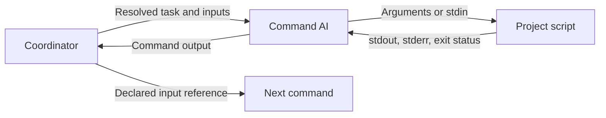

# Commands that use project scripts

[Back to the README](../README.md)

A command can instruct its executing AI to call an existing script, inspect the exit status and return
either its exact machine-readable output or an evidence-based report. Use scripts for mechanical work:
resolving configuration, normalizing names, validating constraints and running established test tools.
Use the AI for judgment: analyzing requirements, interpreting failures, implementing changes and reviewing code.



The recipe engine runs catalog **commands and steps**, not arbitrary shell steps. `uses` names a command, step or recipe;
there is no recipe `run:` field or `executor: shell`. A deterministic script does not make an AI's entire
response deterministic: define how its output must be returned and checked at the command boundary.
See the [runnable context helper and test workflow](../examples/runtime-tests/README.md).

## Location and ownership

Keep project-owned helpers under `.ai-evo-prj/scripts/`, with their configuration under
`.ai-evo-prj/skills/config/`. Existing application tools can remain under paths such as `scripts/run-unit-tests`.
Document the working directory, interpreter, dependencies and path in the command's `Procedure`.

AI Evo Skills command directories may contain **only `SKILL.md`**. Although the general Agent Skills format
allows bundled resources, this project's validator rejects a `scripts/` subdirectory inside a command.
Keep helpers outside command directories and use paths resolved from the application root. With shared
specifications, the script may live outside the application checkout; use the caller's Git root to identify
the worktree, not the resolved location of the script itself.

`init` and `sync` do not install project tools or grant permission to execute them. `validate` checks the
skill contract, not referenced scripts, their dependencies or output schemas. Version and test helpers
alongside the specifications or application that owns them.

## Define the script and command contracts

| Contract | What to declare |
|---|---|
| Inputs | Named options, argv elements, stdin JSON or a documented input file; avoid interpolating input into shell code. |
| Preconditions | Required config, current directory, runtime and available local tools. |
| Success | Exit code 0 plus an exact token, versioned JSON payload or a report based on captured evidence. |
| Failure | Nonzero exit, diagnostic stderr and any documented failure payload; never substitute a successful default. |
| Side effects | Files, test caches, Git refs, configuration or remote state the helper may change. |
| Output consumer | A `when` condition, another command input or the final user report. |

For a detector, keep stdout limited to the success token or JSON. Put progress and diagnostics on stderr.
If a validator returns JSON with `valid: false` and a nonzero status, that JSON is diagnostic data, not a
successful step result. Determinism means the same inputs, configuration and observed state produce the
same decision; scripts inspecting Git or running tests also depend on that state.

For example, the context command runs:

```bash
python3 .ai-evo-prj/scripts/acme-worktree-context.py --field context
```

Its instructions require a zero exit code, a `php72` or `php83` token and return of stdout unchanged.
They forbid explanations or Markdown around the token. The recipe coordinator checks that token before
recording success, and its Unit step uses:

```yaml
when:
  value: "${{ steps.php_context.output }}"
  normalize: trim
  equals: php83
```

`normalize: trim` applies only to the comparison. It does not rewrite the journal or downstream input.
The runtime accepts successful output strings; it does not enforce a command-specific token enum or JSON
schema. The command/coordinator must perform those checks. A typo such as `php8` must fail before it can
silently select a skipped branch.

For JSON, pass `${{ steps.plan.output }}` as a whole string input and tell the consuming command how to
validate and parse it. The engine does not support references such as `${{ steps.plan.output.branches }}`.
For large logs, document an artifact path and its lifecycle explicitly; passing a path does not embed the
file contents or establish that another executor can read it.

## Adapter permissions

Scripts run under the command's resolved policy and the selected adapter's actual tool permissions.
Calling a script from a prompt does not bypass either. Choose policies according to the work: a context
lookup is read-only; tests may need writable caches; publishing a stack requires network access and writes.

With the bundled adapters:

- Codex can run a local Python helper under a read-only, network-disabled sandbox when the interpreter
  and files are accessible. Helpers must respect the sandbox; a test command may need `read-write`.
- Claude's `workspace: read-only` translation restricts Bash to the fixed Git wrapper and explicitly declared capabilities.
  The GitHub wrapper supports only `auth-status`, `repo-view` and `issue-view NUMBER`.
  With `network: disabled`, only `.ai-evo/bin/ai-evo-git-read` remains available.
  Declare `github.auth-status`, `github.repo-view` and/or `github.issue-view` in `execution-policy.capabilities`.
  A network-disabled profile blocks planning when a GitHub capability is required.
  Arbitrary project scripts and test runners are unavailable in these restricted modes.
  A prompt or effort-profile preference cannot add them to the permitted tool set.

The runtime-tests recipe therefore assigns script and test steps to `executor: codex`; Claude may still
coordinate and summarize. This is an adaptation of the source workflow, not a claim that the Enabu commands
can run unchanged with restrictive Claude policies. For another adapter, verify its enforcement and native
permissions before use; do not weaken a command's restrictions merely to make its script run.
See the [execution reference](execution.md#execution-policies-and-prompt-delivery).

## Use cases from the Enabu catalog

The following inventory records patterns observed in the local `specs-enabu` catalog. Source names identify
the commands and scripts that were inspected; those project-specific implementations are not shipped or
required by this engine. The public example adapts the patterns with generic configuration and wrapper paths.

| Workflow | Commands and data flow in the source catalog | Reusable pattern |
|---|---|---|
| Review and verify | `enabu-cmd-review` → `enabu-cmd-verify-review`; full/security recipes fix the review focus. | Pass the complete report to a verifier that checks findings against code. The source selects Claude for both steps; adapters can differ per call. |
| Delegate implementation | `enabu-cmd-implement-work` → `enabu-cmd-verify-impl`. | Supply conversation summary, specification, acceptance criteria and constraints explicitly; verify the implementation report against those criteria. |
| Select applicable tests | `enabu-cmd-detect-php-ctx` → legacy tests → conditional Unit tests → `enabu-cmd-report-test-results`. | A script supplies a stable context token; the recipe selects suites and preserves skip semantics. See the [adapted example](../examples/runtime-tests/README.md). |
| Diagnose failed tests | `enabu-cmd-diagnose-unit-failure` consumes runner output and intended behavior. | Distinguish implementation regression, invalid test, environment/fixture problems and an ambiguous functional contract before recommending a correction. Invoke separately after a failed recipe. |
| Extract business logic | Prepare a branch → cover the controller with tests → review/commit coverage → analyze → extract a stack → analyze/review/verify the result. | AI selects cohesive work items; deterministic scripts produce names and the ordered branch manifest. Implementation consumes the analysis and verification checks the resulting code. |
| Commit and publish a stack | `enabu-cmd-commit-current-changes` and the separate `enabu-cmd-submit-git-stack`. | Validate a proposed commit message, inspect stack state, then apply authorized changes. Publication is separate from analysis and local implementation. |

In the extraction workflow, iterating over manifest items happens inside the extraction command. It does
not imply that recipes support dynamic fan-out or loops. Source recipes execute their declared steps in order.

## Script inventory and callers

The source stores these six executable helpers under `.ai-evo-prj/scripts/`. Their shared Python library,
`scripts/lib/enabu_script_common.py`, supplies configuration, Git and JSON utilities; it is not a command step.

| Source helper | Direct command callers | Output and role |
|---|---|---|
| `enabu-worktree-context` | `detect-php-ctx`, `prepare-git-stacked-branch` | JSON context/tool mapping, or a scalar with `--field context`; rejects unknown worktree roots. |
| `enabu-git-stacked-branch-name` | `prepare-git-stacked-branch`; also called by the stack-plan helper | One normalized, Git-validated branch name; the AI does not reimplement naming rules. |
| `enabu-git-stack-plan` | `extract-ctrl-biz-stack` | Versioned JSON manifest of ordered items, branch names, parents and existing refs; consumes an ordered methods file. Planning does not create branches. |
| `enabu-git-stack-state` | `prepare-git-stacked-branch`, `extract-ctrl-biz-stack`, `submit-git-stack` | JSON of local stack refs, ancestry and cleanliness, including `valid` and `errors`; violations exit nonzero. |
| `enabu-git-commit-check` | `commit-current-changes` | JSON validity/errors for a message file and issue number; does not create the commit and exits nonzero on invalid content. |
| `enabu-git-stack-upstreams` | `submit-git-stack` | `inspect` produces a remote/local ref manifest; `apply` rechecks it, fetches matching refs and updates local upstream configuration. These operations require network; apply has local side effects. |

Caller names in this table omit the shared `enabu-cmd-` prefix. The source test commands also use existing
runtime wrappers (`php7testlegacy`, `php8testlegacy`, `php8unittest --testsuite Unit`) rather than reproducing
test-runner logic. These environment-specific tools are not included among the six specification helpers.

For a new project, maintain the same inventory with its actual helper paths, direct callers, output contracts,
runtime dependencies and side effects. The `acme-worktree-context.py` example demonstrates the scalar/JSON
pattern without importing Enabu's VM paths, branch conventions or publication machinery.

## Verify the integration

Run the helper directly against known success and failure fixtures, then validate and plan the catalog.
For context selection, cover both supported contexts, an unconfigured root, invalid configuration and a
subdirectory or symlinked checkout. For a runner, verify nonzero statuses survive through its wrapper.
For a recipe, check successful routing, skip propagation and stopping on failure separately from live AI execution.

An AI reporting a tool failure can still exit its native CLI successfully. The coordinator must record task
failure when the command contract fails; native process status alone is not proof of successful tests.
Once a failure is recorded, `recipe advance` stops the workflow. A later report or diagnosis step does not
run as an automatic error handler. See the [runtime protocol](recipe-runtime.md#coordinator-loop).
